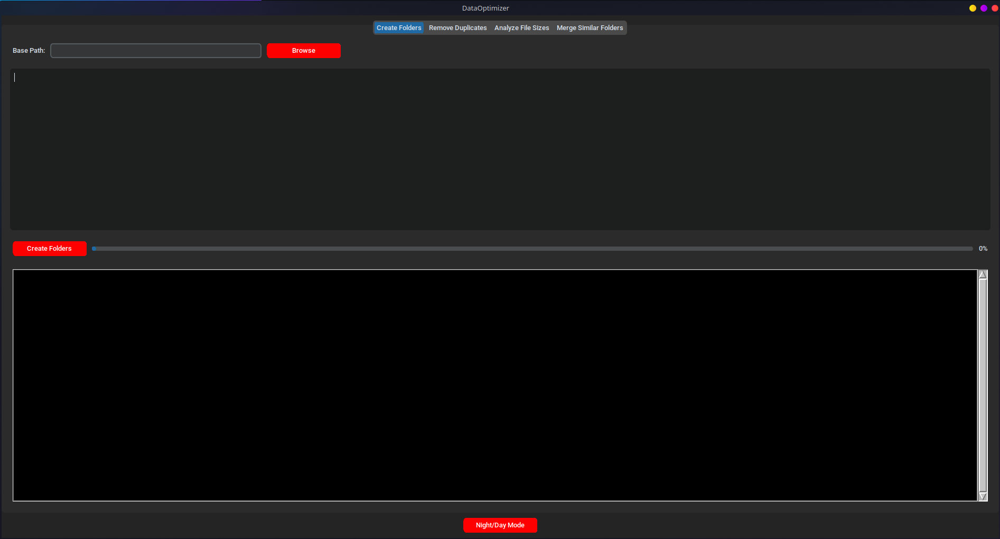
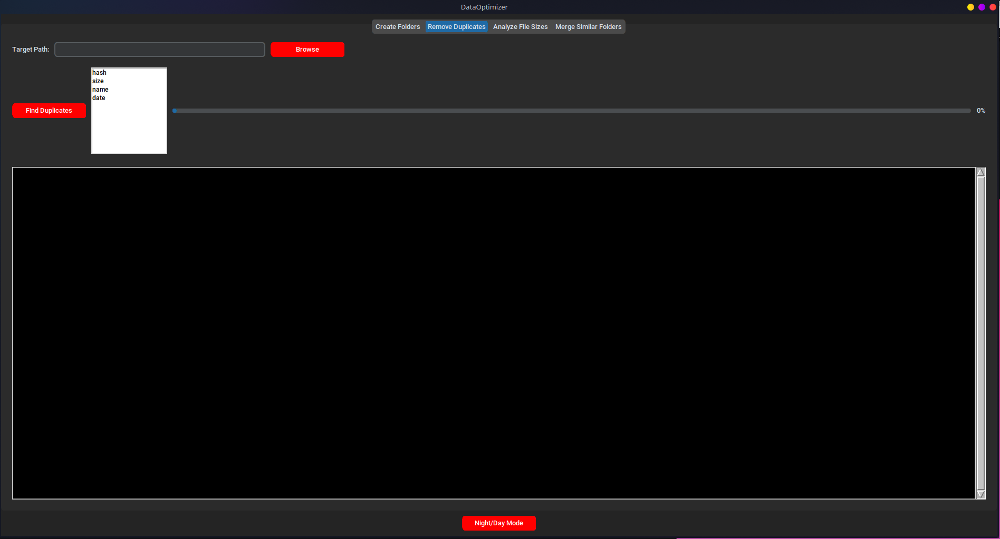
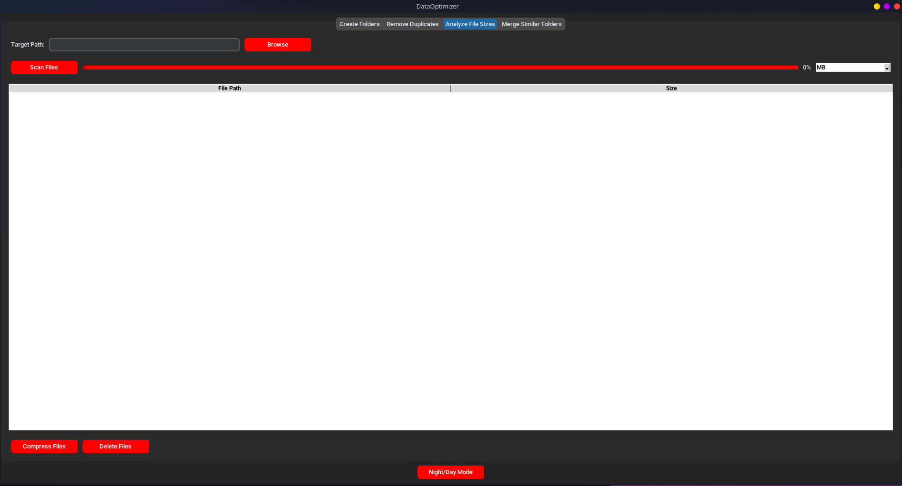
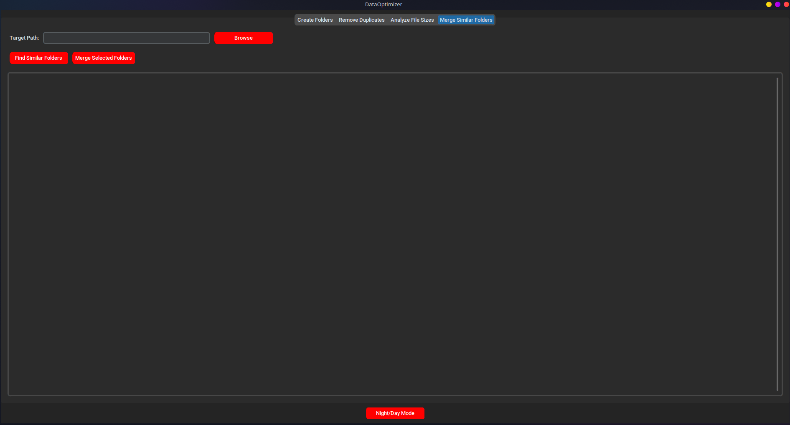

# 📁 DataOptimizer

Welcome to **DataOptimizer**! This tool is designed to help you manage and optimize your data by creating directories, removing duplicates, analyzing file sizes, and merging similar folders.

## Features

- 📂 **Create Directories**: Easily create a list of directories based on your specifications.
- 🗃️ **Remove Duplicates**: Find and remove duplicate files based on hash, size, name, or modification date.
- 📏 **Analyze File Sizes**: Scan and list files by size to identify large files.
- 🛠️ **Merge Similar Folders**: Automatically detect and merge folders with similar structures.

## Installation

1. Clone the repository:
    ```sh
    git clone https://github.com/tilltmk/DataOptimizer.git
    ```
2. Navigate to the project directory:
    ```sh
    cd DataOptimizer
    ```
3. Install the required dependencies:
    ```sh
    pip install -r requirements.txt
    ```

## Usage

Run the application using Python:
```sh
python main.py
```

## How It Works

### Create Directories

1. Go to the "Create Directories" tab.
2. Browse and select the base path.
3. Enter the list of directories to be created.
4. Click on "Create Directories".

### Remove Duplicates

1. Go to the "Remove Duplicates" tab.
2. Browse and select the target path.
3. Select the methods to find duplicates (hash, size, name, date).
4. Click on "Find Duplicates".

### Analyze File Sizes

1. Go to the "Analyze File Sizes" tab.
2. Browse and select the target path.
3. Click on "Scan Files".
4. Optionally, select files and choose to compress or delete them.

### Merge Similar Folders

1. Go to the "Merge Similar Folders" tab.
2. Browse and select the target path.
3. Click on "Find Similar Folders".
4. Select the folders to merge and click on "Merge Selected".

## Screenshots







## Contributing

Contributions are welcome! Please open an issue or submit a pull request.

## Contact

Feel free to reach out with any questions or feedback.

- GitHub: [tilltmk](https://github.com/tilltmk)

---

Thank you for using DataOptimizer! 🚀
